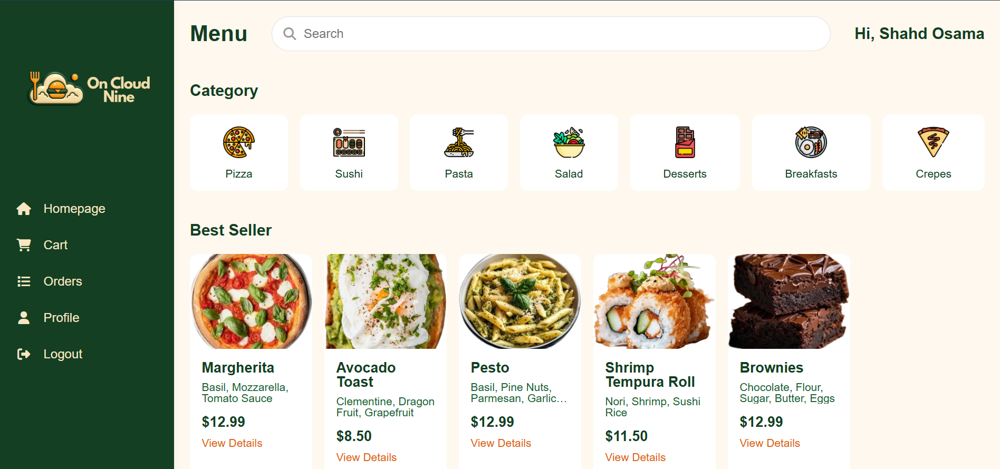
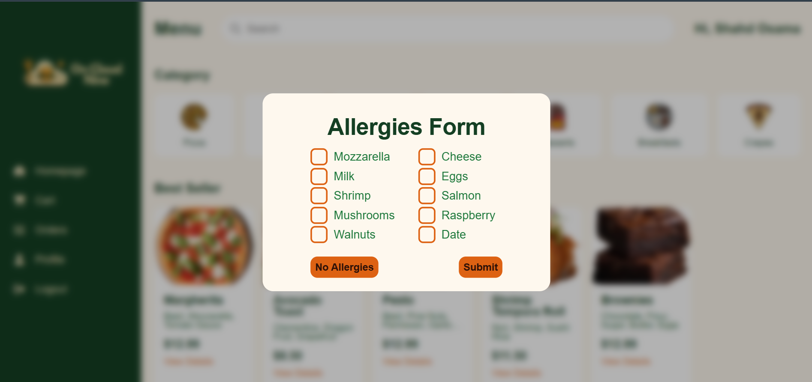
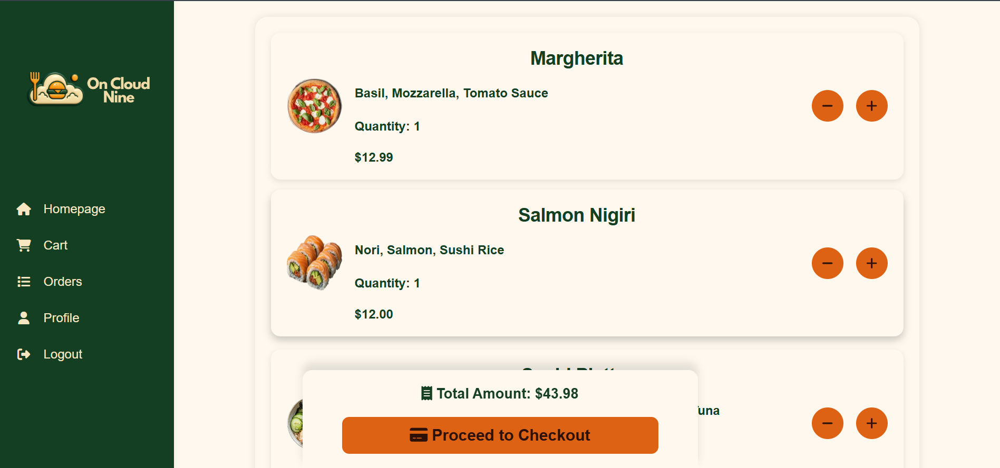
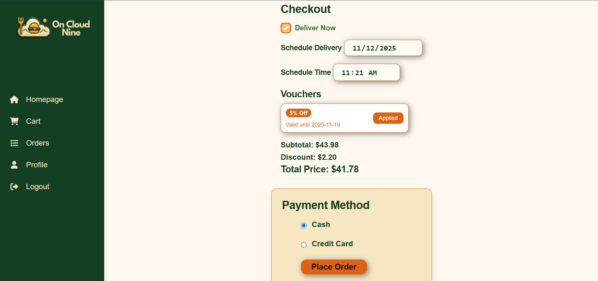
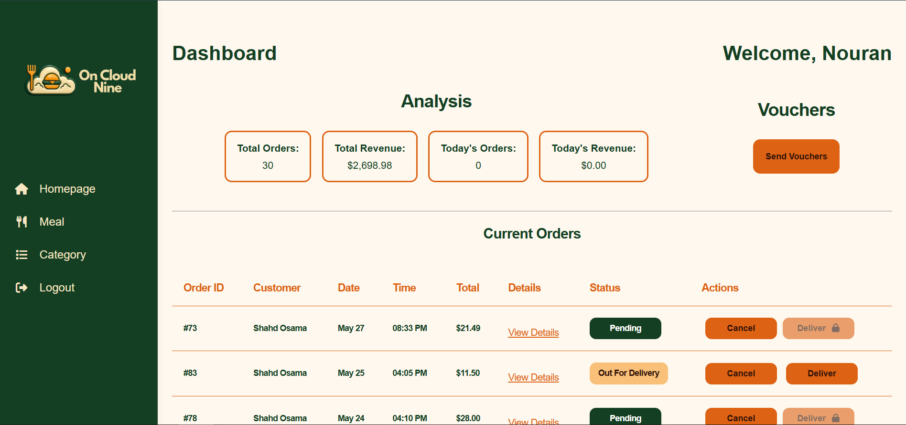
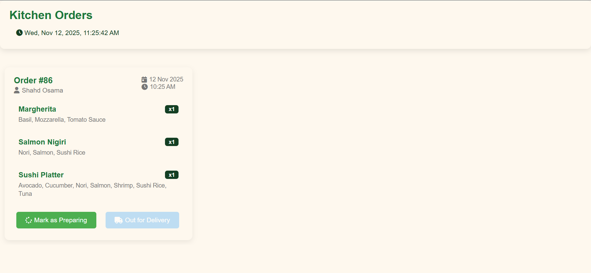

# 🍕 OnCloudNine - Food Ordering System

[](https://php.net)
[](https://www.mysql.com/)
[](https://developer.mozilla.org/en-US/docs/Web/HTML)
[](https://developer.mozilla.org/en-US/docs/Web/CSS)
[](https://developer.mozilla.org/en-US/docs/Web/JavaScript)

> A comprehensive web-based food ordering system developed as a college project for AAST (Arab Academy for Science and Technology)

<p align="center">
  
</p>

---

## 📚 Table of Contents

- [Overview](#-overview)
- [Demo/Screenshots](#-demoscreenshots)
- [Features](#-features)
- [Technical Details](#-technical-details)
- [Acknowledgments](#-acknowledgments)

---

## 🎯 Overview

### Project Description

**OnCloudNine** is a full-stack web application that provides a seamless food ordering experience for university students and staff. This project was developed as part of the **Web Programming** course during the **4th semester** at **AAST (Arab Academy for Science and Technology)**.

### Problem Statement

The project addresses the need for an efficient, user-friendly food ordering system within the university campus, eliminating long queues and providing a convenient way to order meals from various campus restaurants.

### Key Features

- 🍔 **Multi-category Menu System** - Browse through various food categories
- 🛒 **Shopping Cart** - Add, remove, and manage food items
- 💳 **Checkout System** - Seamless order placement with attendance-based payment
- 🎁 **Voucher System** - Admin-triggered discount vouchers distributed based on student attendance
- 👤 **User Authentication** - Secure login system integrated with university accounts
- 🏥 **Allergy Management** - Track and manage food allergies for safe ordering
- 👨‍🍳 **Kitchen Dashboard** - Real-time order management for kitchen staff
- 🛠️ **Admin Panel** - Complete CRUD operations for menu management

### Target Audience

- University students and staff at AAST
- Campus restaurant managers
- Kitchen staff and food service personnel

### Project Documentation

📄 **[Software Requirements Specification (SRS)](./docs/OCN_SRS.pdf)** - Comprehensive project requirements and specifications

---

## 🖼️ Screenshots

### Home Page



_Browse through various food categories and featured meals_

### Allergy Management Form



_First-time users can register their food allergies for safe ordering_

### Shopping Cart



_Manage your orders with an intuitive shopping cart interface_

### Checkout



_Complete your order with our streamlined checkout process and redeem attendance-based vouchers_

### Admin Dashboard



_Comprehensive admin panel for managing meals and categories_

### Kitchen Dashboard



_Real-time order management for kitchen staff to track and update order status_

---

## ✨ Features

### Current Features

#### 🎯 User Features

- ✅ Allergy tracking and management
- ✅ Secure authentication with university integration
- ✅ Browse meals by categories (7 categories available)
- ✅ Detailed meal information with images
- ✅ Shopping cart with quantity management
- ✅ Seamless checkout process with attendance-based payment deduction
- ✅ Attendance-based voucher system - Receive discount vouchers based on attendance records
- ✅ Order history and reordering functionality
- ✅ User profile management

#### 👨‍💼 Admin Features

- ✅ Comprehensive admin dashboard
- ✅ CRUD operations for meal categories
- ✅ CRUD operations for individual meals
- ✅ Order management and tracking
- ✅ User management capabilities
- ✅ Real-time order status updates
- ✅ Voucher distribution system - Send discount vouchers to students based on attendance

#### 👨‍🍳 Kitchen Features

- ✅ Dedicated kitchen dashboard
- ✅ Real-time order queue
- ✅ Order status management
- ✅ Order completion notifications

### 🚧 Planned Features (Roadmap)

- 📱 Mobile application
- 💳 Online payment integration
- 🔔 Push notifications for order updates
- 🤖 AI-based meal recommendations

---

## 🛠️ Technical Details

### Architecture Overview

```
OnCloudNine_PHP/
├── components/          # Reusable PHP components
├── img/                 # Images and assets
│   ├── aast_imgs/      # University specific images
│   ├── category/       # Category icons
│   ├── icons/          # UI icons
│   ├── logo/           # Project logos
│   └── meals/          # Food images by category
├── js/                  # JavaScript files
├── pages/              # Main application pages
│   ├── admin/          # Admin panel pages
│   ├── aast/           # University specific pages
│   └── user/           # User interface pages
├── php/                # Backend PHP scripts
├── style/              # CSS stylesheets
│   ├── base/           # Base styles and variables
│   ├── components/     # Component-specific styles
│   └── pages/          # Page-specific styles
└── index.html          # Landing page
```

### Technology Stack

#### Frontend

- **HTML5** - Semantic markup
- **CSS3** - Modern styling with custom properties
- **JavaScript (ES6+)** - Interactive functionality
- **Responsive Design** - Mobile-first approach

#### Backend

- **PHP 7.4+** - Server-side logic
- **MySQL** - Database management
- **Session Management** - User authentication
- **Prepared Statements** - SQL injection prevention

#### Development Environment

- **IDE**: VS Code
- **Version Control**: Git
- **Local Server**: XAMPP
- **Database Tool**: phpMyAdmin

---

## 🙏 Acknowledgments

### Development Team

**Moaz Wael**
**Shahd Osama**

### Inspiration

## On Cloud Nine is a campus meal ordering and delivery system that works exclusively with integrated college portals, addressing key challenges students faced including space limitations, order delays, payment constraints, and the need for better allergy management and feedback systems.

<p align="center">
  Made with ❤️ by the OnCloudNine Team
  <br>
  © 2024 OnCloudNine - AAST Web Programming Project
</p>
